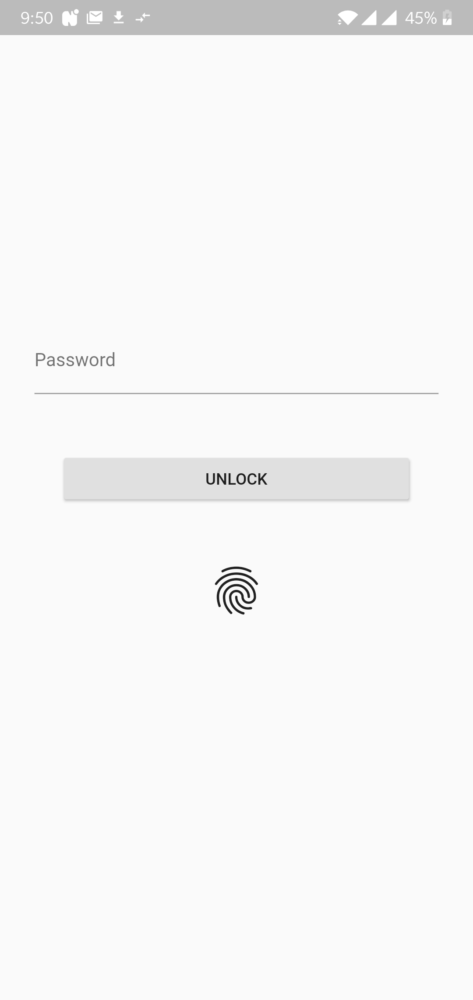
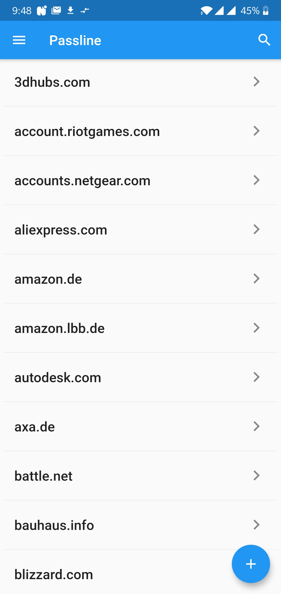
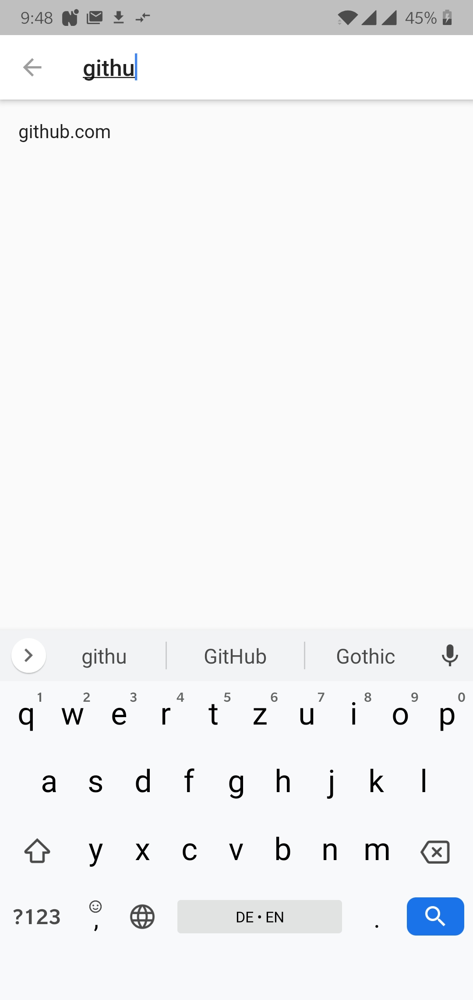

<h1 align="center">
  Passline Mobile
</h1>

<h4 align="center">
  Use Passline on your mobile phone
</h4>

  

## Description

Passline mobile app

## Highlights

- Biometric Authentication

## Contents

- [Description](#description)
- [Highlights](#highlights)
- [Contents](#contents)
- [Demo](#demo)
- [Install](#install)
- [Usage](#usage)
- [Development](#development)
- [Team](#team)
- [License](#license)

## Demo

  
  
  

## Install

## Usage

## Development

### Build

1. `flutter build apk`
2. `flutter install`

### Icon

Nice [tool](https://romannurik.github.io/AndroidAssetStudio/index.html) to create android icons.

## Team

- Thomas Pöhlmann [(@perryrh0dan)](https://github.com/perryrh0dan)

## License

[MIT](https://github.com/perryrh0dan/passline-mobile/blob/master/license.md)